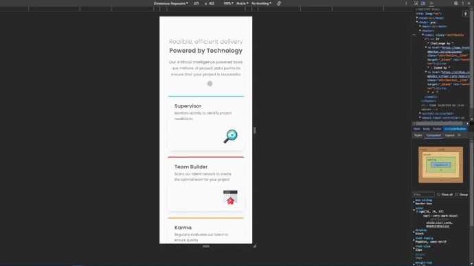
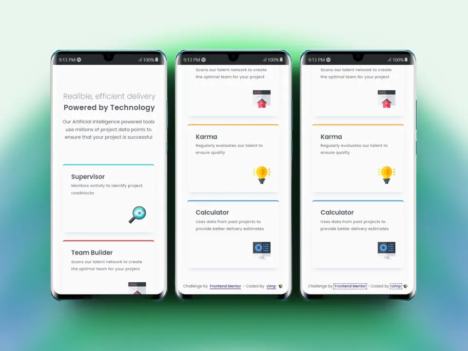
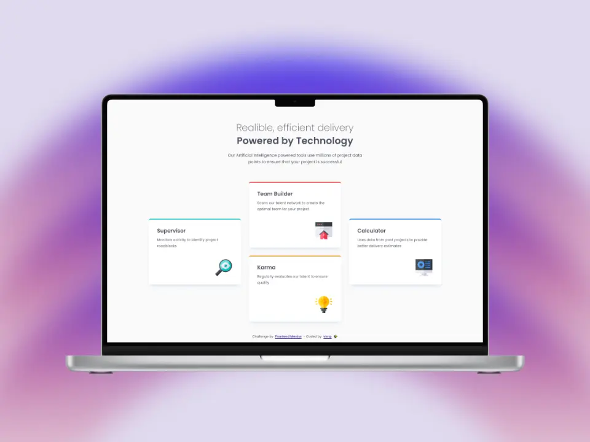

# Frontend Mentor - Four card feature section solution

This is a solution to the [Four card feature section challenge on Frontend Mentor](https://www.frontendmentor.io/challenges/four-card-feature-section-weK1eFYK).

Frontend Mentor challenges help you improve your coding skills by building realistic projects.



## Table of contents

- [Overview](#overview)
  - [The challenge](#the-challenge)
  - [Screenshot](#screenshot)
  - [Links](#links)
- [My process](#my-process)
  - [Built with](#built-with)
  - [What I learned](#what-i-learned)
  - [Useful resources](#useful-resources)
- [Author](#author)

## Overview

### The challenge

Users should be able to:

🎯 View the optimal layout for the site depending on their device's screen size

### Screenshot

#### 📱 Mobile



#### 💻 Desktop



### Links

[Live Site](https://mendez-v.github.io/four-card-feature/) 👀

[Solution in Frontend Mentor](https://www.frontendmentor.io/solutions/four-card-feature-using-css-grid-and-pseudoclasses-jK_lEEdpiL) 👀

[Challenge Repository](https://github.com/mendez-v/frontend-mentor-challenges) 👀

## My process

### Built with

✅ Semantic HTML5 markup

✅ CSS custom properties

✅ CSS Grid

✅ Pseudo-classes

✅ Mobile-first workflow

### What I learned

🔥 The colour is taken from the custom CSS variable called `--shadow` and the opacity from `/.5`.
```css
hsl(from var(--shadow) h s l / .5 )
```

### Useful resources

🖼 Favicon - [Setting](https://iconscout.com/3d-illustrations/setting) by [iqonic.design](https://iconscout.com/contributors/iqonic-design) on [IconScout](https://iconscout.com)

## Author

✨ Frontend Mentor - [@mendez-v](https://www.frontendmentor.io/profile/mendez-v)
